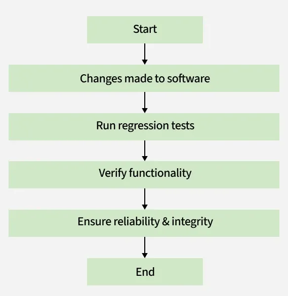

# Cypress 

## What is Cypress ? 

Cypress the Frontend Automation testing tool for testing the Frontend of the applications. 

It was Based for the JS and TS 

It is kind alike to Jquery. but more error Free compared to it and in syntax also.

It also provide the timeout feature to make sure if the element of website or the frontend may takes time to load 

```
// Give this element 10 seconds to appear
cy.get('.my-slow-selector', { timeout: 10000 })
```
note the default timeout is of 4 seconds 

## Chain of Commands 

Cypress use the Chain Commands , Provides the Promise Chain. it will running continuosly until got an error or chain is completed

### Interaction with elements 

Cypress Also provide the Interactions to the Dom elements like here is the example which also have certain commands and methods which are built in Cypress.

### Assesting About the Elements 

Assertions let you do things like ensuring an element is visible or has a particular attribute, CSS class, or state. Assertions are commands that enable you to describe the desired state of your application

example : 
```
cy.get(':checkbox').should('be.disabled')

cy.get('form').should('have.class', 'form-horizontal')

cy.get('input').should('not.have.value', 'US')
```

### Subject Management : 

A new Cypress chain always starts with cy.[command], where what is yielded by the command establishes what other commands can be called next (chained).


## Commands are Ascynchronous

It is very important to understand that Cypress commands don't do anything at the moment they are invoked, but rather enqueue themselves to be run later. This is what we mean when we say Cypress commands are asynchronous.

        note : Cypress will run the synchronous code immediately they invoked they don't wait other code to complete

- WE have to write the code such way that the dependent sync code should be run together and with async to prevent the undefined values and things.

- Each Command May have the different timeout and configurations mentioned in the docs

- Cypress commands and queries are not promises

- we cannot race or run multiple commands at the same time


## Timeouts
Almost all commands can time out in some way.

All assertions, whether they're the default ones or whether they've been added by you all share the same timeout values.

### Applying Timeouts

You can modify a commands's timeout. This timeout affects both its default assertions (if any) and any specific assertions you've added.


# Component Testing 

## End to End Testing

    In End to End testing , the testing of the application is done in the such a way that the Application is tested according to how the normal or end user is going to interact with the application.

    Benefits of end-to-end tests:
    - Ensure your app is functioning as a cohesive whole
    - Tests match the user experience
    - Can be written by developers or QA Teams
    - Can be used for integration testing as well

## Component Testing 

    Modern web frameworks provide ways to write applications by breaking them into smaller logical units called components. Components can range from fairly small (like a button) to more complex (like a registration form).

    - Because of their nature, components tend to be easily testable, which is where Cypress Component Testing comes into play.

    - Easier to test components in isolation
    - Fast and reliable
    - Easy to set up specific scenarios in tests
    - Don't rely on any external system to run

## Functional Testing 

    The Functional Testing is defined as a Type of black box testing which can be done manually or automatically with the automation tools like cypress. 

    - Purpose of the Functional Testing are 
      
      - Test the Flow of the GUI Screen
      - Test the primary entry Function 
      - Test Each Function of the Application

## Regression Testing 

    involves re-executing a previously created test suite to verify that recent code changes haven't caused new issues. This verifies that updates, bug fixes, or enhancements do not break the functionality of the application.


    - When to do regression testing 
        
        - When new functionality is added to the system and the code has been modified to absorb and integrate that functionality with the existing code.
        - When some defect has been identified in the software and the code is debugged to fix it.
        - When the code is modified to optimize its working.

